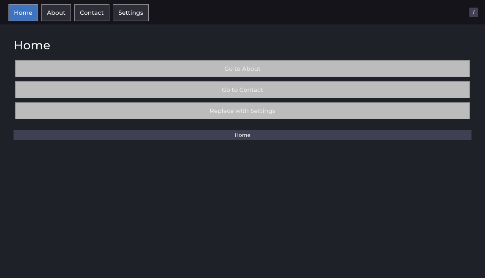
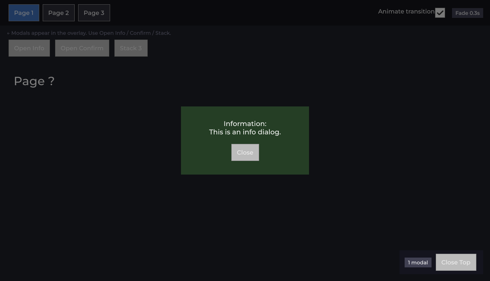
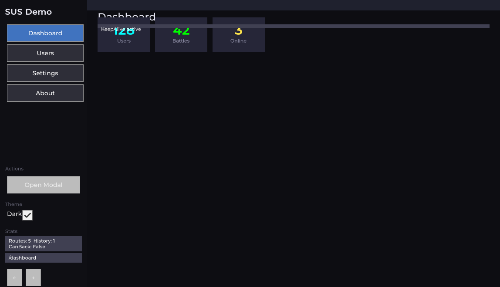
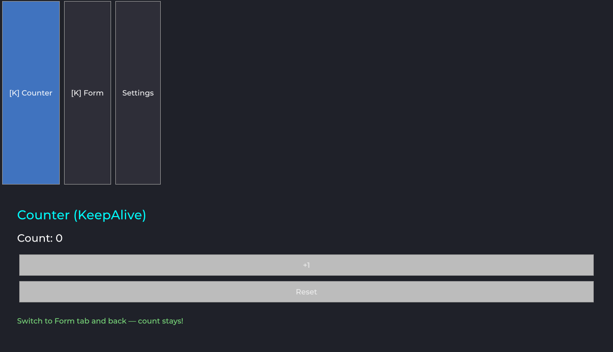

# SUS Router (`com.sharq-it.sus.router`)

Navigation for SUS — a **vue-router** analog for Unity UI Toolkit. Screens, nested routes,
guards, keep-alive, modals, and transitions on top of `sus-core`.

**License:** [MIT](./LICENSE.md)

**Community & support:** [Discord](https://discord.gg/gwS9nwqWWj) · [Telegram](https://t.me/sus_public)

<!-- sus:gen ver pkg=sus-router -->
> **Version:** 1.0.10 · **Namespace:** `Sharq.Router` · **Depends on:** `com.sharq-it.sus.core` (^1.0.0) <!-- sus:ok dependency range -->
<!-- /sus:gen -->

## Requirements

<!-- sus:gen unity kind=min -->
- **Unity 6000.3** or newer
<!-- /sus:gen -->
- **UI Toolkit only** — same floor as `sus-core`
- Requires **`com.sharq-it.sus.core`** (sibling package; not bundled here)

## What is not included

- Reactivity, the `.sharq` compiler, themes, overlays, and icons live in **`sus-core`** — install that package first.
- Ready-made screen widgets and HUD layouts are **not** in this package; it is navigation only.

## Quick start (via `SusApp`)

```csharp
using Sharq.Core;
using Sharq.Router;

SusApp.Create(GetComponent<UIDocument>())
    .UseTheme(SusTheme.Dark)
    .UseRouter(new SusRouter(), routes => routes
        .Route("/", typeof(HomeScreen)).Name("home")
        .Route("/user/:id", typeof(UserScreen)).KeepAlive()
        .Route("/settings", typeof(SettingsLayout)).Children(c => c
            .Route("profile", typeof(ProfileScreen))),
        initialPath: "/")
    .Run();
```

## Core types

| Type | Purpose |
|------|---------|
| `SusRouter` | Core: `Register`, `Push`/`Replace`/`Back`, history stack (cap `MaxHistory`), guards |
| `SusRouteBuilder` | Declarative route tree (`Route/Name/KeepAlive/Alias/Redirect/Meta/Guard/BeforeEnter/Props/PropsFn/Lazy/Transition/Children`) → `ApplyTo(router)` |
| `SusScreen` | Base screen: lifecycle `BeforeEnter/Entered/BeforeRouteUpdate/BeforeLeave/Left`, `GetParam`/`GetQuery`, `ChildView` for nested |
| `SusRouteView` | Mount slot (root and nested `ChildView`) |
| `SusModal` / `SusModalService` | Modal screens via OverlayHost |
| `SusAppRouterExtensions` | `SusApp.UseRouter(...)` — register + mount at the correct finalization point |

## Key capabilities

- **params/query → Props**: priority `PropsFn → DefaultProps → query → params → explicit props`.
- **Nested routes**: parent stays mounted; child renders into its `ChildView`.
- **KeepAlive**: cached screen instances; key via `KeepAliveKey(route)` (option `KeepAliveIgnoreQuery`).
- **Guards**: sync and async `BeforeEnter`/`BeforeLeave`/`beforeResolve`.


## Gallery

Package samples (raw UITK after rewrite) — routing, modals, keep-alive, full demo:

<table>
<tr>
<td><br><sub>BasicRouting — tabs + Push/Replace</sub></td>
<td><br><sub>Modal — OverlayHost info dialog</sub></td>
</tr>
<tr>
<td><br><sub>FullDemo — sidebar + nested screens</sub></td>
<td><br><sub>KeepAlive — counter state preserved</sub></td>
</tr>
</table>

## Namespace

Router types live in `Sharq.Router` (after the P1.4 refactor). Import both namespaces:
`using Sharq.Core;` (bootstrap/components) + `using Sharq.Router;` (screens/navigation).

## Documentation

- Package docs: [`docs/README.md`](docs/README.md)
- SUS core: [`sus-core/Docs/README.md`](../sus-core/Docs/README.md)
- Integration pitfalls: [`sus-core/Docs/SUS_INTEGRATION_KNOWN_ISSUES.md`](../sus-core/Docs/SUS_INTEGRATION_KNOWN_ISSUES.md)
