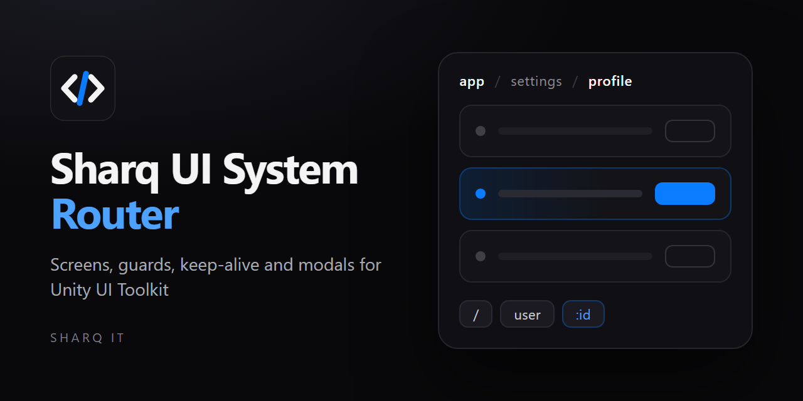

<p align="center">
  
</p>

<p align="center">
  
</p>

# Sharq UI System Router

[English](./README.md) · 简体中文

**SUS Router**（`com.sharq-it.sus.router`）—— SUS 的导航层，对标 **vue-router** 在
Unity UI Toolkit 上的实现：屏幕、嵌套路由、守卫、KeepAlive、模态、过渡，构建在
`sus-core` 之上。

**适用引擎：Unity 6000.3 及以上（全球版 Unity 6，`unity.com`）。** 与 `sus-core` 的要求
一致；**不针对**团结引擎（Tuanjie／统一引擎）或其他 Unity China 分支，尚未验证，也没有
移植计划。

**协议：** [MIT](./LICENSE.md)

**社区与支持：** [support@sus-ui.dev](mailto:support@sus-ui.dev) · GitHub Issues ·
（Discord / Telegram 在中国大陆网络环境下不可用，优先使用邮件或 Issues）

**测试与发布：** 169 个自动化测试 · [CHANGELOG](./CHANGELOG.md) ·
[GitHub Releases](https://github.com/antaresdk/sus-router/releases)

**版本：** 1.0.15（发布本文件时的快照，权威版本见英文 [README.md](./README.md) 顶部的
自动生成区块）· **命名空间：** `Sharq.Router` · **依赖：** `com.sharq-it.sus.core` (^1.0.0)

## 环境要求

- **Unity 6000.3** 或更新版本
- **仅支持 UI Toolkit** —— 与 `sus-core` 要求一致
- 需要 **`com.sharq-it.sus.core`**（兄弟包，不随本包附带）

## 包内不含的内容

- 响应式、`.sharq` 编译器、主题、overlay、图标都在 **`sus-core`** 中 —— 请先安装那个包。
- 现成的屏幕组件和 HUD 布局**不在**本包中；本包只负责导航。

## 快速开始（通过 `SusApp`）

```csharp
using Sharq.Core;
using Sharq.Router;

SusApp.Create(GetComponent<UIDocument>())
    .UseTheme(SusTheme.Dark)
    .UseRouter(new SusRouter(), routes => routes
        .Route("/", typeof(HomeScreen)).Name("home")
        .Route("/user/:id", typeof(UserScreen)).KeepAlive()
        .Route("/settings", typeof(SettingsLayout)).Children(c => c
            .Route("profile", typeof(ProfileScreen))),
        initialPath: "/")
    .Run();
```

更完整的从零开始教程见
[`docs/GETTING_STARTED.zh-CN.md`](./docs/GETTING_STARTED.zh-CN.md)。

## 核心类型

| 类型 | 作用 |
|------|------|
| `SusRouter` | 核心：`Register`、`Push`/`Replace`/`Back`、历史栈（上限 `MaxHistory`）、守卫 |
| `SusRouteBuilder` | 声明式路由树（`Route/Name/KeepAlive/Alias/Redirect/Meta/Guard/BeforeEnter/Props/PropsFn/Lazy/Transition/Children`）→ `ApplyTo(router)` |
| `SusScreen` | 屏幕基类：生命周期 `BeforeEnter/Entered/BeforeRouteUpdate/BeforeLeave/Left`、`GetParam`/`GetQuery`、嵌套用 `ChildView` |
| `SusRouteView` | 挂载槽位（根节点和嵌套 `ChildView`） |
| `SusModal` / `SusModalService` | 通过 OverlayHost 实现的模态屏幕 |
| `SusAppRouterExtensions` | `SusApp.UseRouter(...)` —— 在正确的 finalization 时机注册并挂载 |

## 关键能力

- **params/query → Props**：优先级 `PropsFn → DefaultProps → query → params → 显式 props`。
- **嵌套路由**：父屏幕保持挂载；子屏幕渲染到它的 `ChildView` 中。
- **KeepAlive**：缓存屏幕实例；键由 `KeepAliveKey(route)` 决定（选项 `KeepAliveIgnoreQuery`）。
- **守卫**：同步与异步的 `BeforeEnter`/`BeforeLeave`/`beforeResolve`。

## 画廊

包内示例（重写后运行在原生 UITK 上）——路由、模态、KeepAlive、完整 demo：

<table>
<tr>
<td><br><sub>BasicRouting —— tabs + Push/Replace</sub></td>
<td><br><sub>Modal —— OverlayHost 信息对话框</sub></td>
</tr>
<tr>
<td><br><sub>FullDemo —— 侧边栏 + 嵌套屏幕</sub></td>
<td><br><sub>KeepAlive —— 计数器状态保留</sub></td>
</tr>
</table>

## 命名空间

路由类型位于 `Sharq.Router`（P1.4 重构之后）。两个命名空间都要引入：
`using Sharq.Core;`（bootstrap/组件）+ `using Sharq.Router;`（屏幕/导航）。

## 文档

- 包内指南：[`docs/README.md`](docs/README.md)（英文）·
  [`docs/GETTING_STARTED.zh-CN.md`](docs/GETTING_STARTED.zh-CN.md)（中文入门）
- SUS core：[`sus-core/README.zh-CN.md`](../sus-core/README.zh-CN.md)
- 集成注意事项：[`sus-core/Docs/SUS_INTEGRATION_KNOWN_ISSUES.md`](../sus-core/Docs/SUS_INTEGRATION_KNOWN_ISSUES.md)（英文）
- 公开 demo（可克隆的运行时示例）：[sus-demo-public](https://github.com/antaresdk/sus-demo-public)
